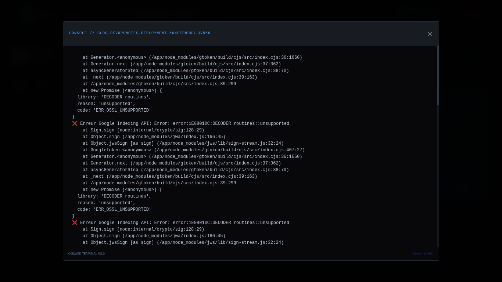

### K-Guard
[🇫🇷 Version Française](version-française) | [🇺🇸 English Version](#english-version)

<a name="version-française"></a>

## 🛡️ K-Guard : Opérateur de Maintenance & Sécurité automatisé pour clusters Kubernetes

K-Guard est un dashboard SRE (Site Reliability Engineering) dédié à l'observabilité et à l'audit de sécurité automatisé pour clusters K3s. Conçu pour offrir une visibilité en temps réel sur l'état de santé des Pods et leur surface d'attaque, K-Guard intègre des fonctions de remédiation immédiates : redémarrage de services, délestage dynamique des réplicas en cas de saturation CPU/RAM, et signalement de mise à jour des images conteneurisées suite à la détection de vulnérabilités critiques.


## 🚀 Fonctionnalités Clés

Health Monitoring : Visualisation dynamique de la charge CPU/RAM avec seuils de criticité intelligents (Bleu/Orange/Rouge).

Security Audit : Intégration native de Trivy pour le scan de vulnérabilités (CVE) des images conteneurs.


Statut Dynamique : Interprétation automatique des niveaux de risque (SECURE, WATCH OUT, UPDATE REQUIRED).

Gestion Opérationnelle : Consultation des logs en temps réel et redémarrage des Pods via une interface sécurisée.



💡 Astuce scan mode Démo : En maintenant Shift lors d'un clic sur "Launch Scan", K-Guard force l'analyse d'une image volontairement obsolète (nginx:1.18). Cette fonction permet de tester instantanément la réactivité du moteur d'audit Trivy et de valider le comportement du dashboard face à des vulnérabilités critiques réelles.


### 🛠️ Stack Technique

Frontend : Vue 3, TypeScript, Tailwind CSS (Design "Cyber" immersif).

Backend : FastAPI (Python), Kubernetes Python Client.

Sécurité : Trivy Engine.

Infrastructure : Cluster K3s sur VPS Ubuntu.

## 🛠️ Configuration Pre-start (Permissions K3s)

Le backend nécessite l'accès au fichier de configuration du cluster K3s pour interagir avec l'API Kubernetes. Par défaut, ce fichier est restreint à l'utilisateur root.

Exécutez les commandes suivantes pour préparer l'environnement :

### 1. Droits d'accès
Donnez les droits de lecture au fichier de configuration (à adapter selon votre politique de sécurité) :
```bash
sudo chmod 644 /etc/rancher/k3s/k3s.yaml
```
### 2. Variable d'environnement
Exportez le chemin de la config pour que la bibliothèque kubernetes-python puisse la trouver :

```Bash
export KUBECONFIG=/etc/rancher/k3s/k3s.yaml
```
Note : Pour rendre ce changement permanent, ajoutez la ligne ci-dessus dans votre ~/.bashrc.

### 3. Vérification
Vérifiez que l'utilisateur peut lire le fichier sans sudo :

```Bash
cat /etc/rancher/k3s/k3s.yaml | grep "server:"
```
## 📦 Installation 

git clone https://gitlab.com/portfolio-kamal-guidadou/k-guard.git

Configurez votre CI_CD_SSH_KEY pour le déploiement automatisé.

Lancez le backend : uvicorn main:app --reload

Lancez le frontend : npm run dev

---------------------------------

Article du projet sur mon blog : https://blog.devopsnotes.org/articles/k-guard-orchestration-sre-et-audit-de-scurit-sur-k3s

Kamal Guidadou 2026


------------------------------------------


<a name="english-version"></a>
🇺🇸 English Version

## 🛡️ K-Guard : Automated Maintenance & Security Operator for Kubernetes clusters

K-Guard is an SRE (Site Reliability Engineering) dashboard designed for observability and automated security auditing within K3s clusters. Built to provide real-time visibility into Pod health and attack surfaces, K-Guard features immediate remediation tools: service restarts, dynamic replica scaling to handle CPU/RAM saturation, and update alerts for container images when critical vulnerabilities are detected.


## 🚀 Key Features

Health Monitoring: Dynamic CPU/RAM tracking with intelligent severity thresholds (Blue/Orange/Red).

Security Audit: Native Trivy integration for automated container image vulnerability (CVE) scanning.


Dynamic Status: Automatic risk level interpretation (SECURE, WATCH OUT, UPDATE REQUIRED).

Ops Management: Real-time log streaming and Pod lifecycle management (Restart/Remediate) through a secure UI.


💡 Demo Mode Scan: By holding Shift while clicking "Launch Scan", K-Guard forces an audit of a deliberately outdated image (nginx:1.18). This feature allows you to instantly test the responsiveness of the Trivy engine and validate how the dashboard handles and reports real-world critical vulnerabilities.


## 🛠️ Technical Stack

Frontend: Vue 3, TypeScript, Tailwind CSS (Immersive "Cyber" UI).

Backend: FastAPI (Python), Kubernetes Python Client.

Security: Trivy Engine.

Infrastructure: K3s Cluster on Ubuntu VPS.

## 🛠️ Pre-configuration & Pre-start (K3s Permissions)
To allow K-Guard to discover and manage your deployments, the backend must interact with the Kubernetes API. By default, the K3s configuration file is restricted to the root user.

Follow these steps to authorize the application without running it as root:

### 1. File Permissions
Grant read access to the cluster configuration file for your current user:

```Bash
sudo chmod 644 /etc/rancher/k3s/k3s.yaml
```

### 2. Environment Variable
The Python Kubernetes client looks for the KUBECONFIG variable. Export the path to point to the K3s config:

```Bash
export KUBECONFIG=/etc/rancher/k3s/k3s.yaml
```

Pro Tip: To make this change persistent across sessions, add the line above to your ~/.bashrc file.

### 3. Connection Validation
Ensure your user can read the configuration without sudo by running:

```Bash
cat /etc/rancher/k3s/k3s.yaml | grep "server:"
```

If you see your cluster IP (e.g., https://127.0.0.1:6443), the backend is ready to launch.

## 📦 Quick Start

git clone https://gitlab.com/portfolio-kamal-guidadou/k-guard.git

Set up your CI_CD_SSH_KEY for automated CI/CD deployment.

Start Backend: uvicorn main:app --reload

Start Frontend: npm run dev

----------------------------

Blog article on the project : https://blog.devopsnotes.org/articles/k-guard-orchestration-sre-et-audit-de-scurit-sur-k3s

Kamal Guidadou 2026