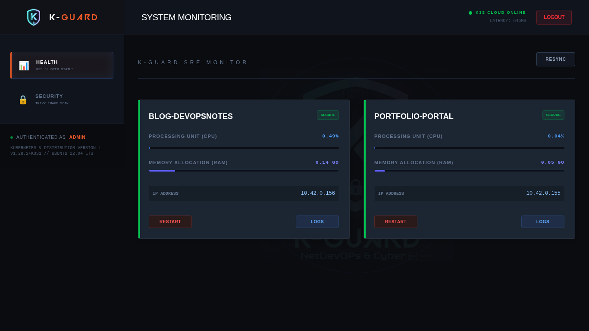
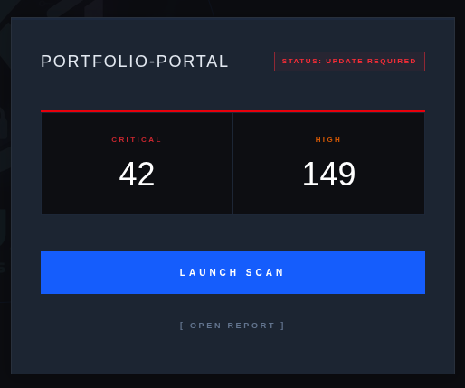
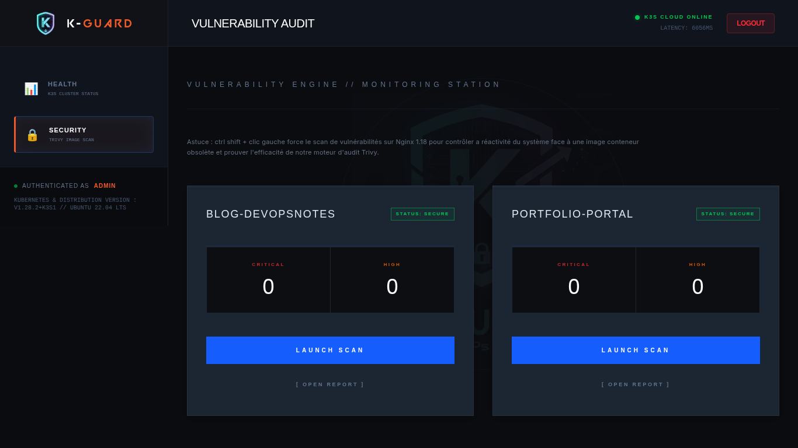

# 🛡️ K-Guard : Opérateur de Maintenance & Sécurité automatisé pour clusters Kubernetes

K-Guard est un dashboard SRE (Site Reliability Engineering) dédié à l'observabilité et à l'audit de sécurité automatisé pour clusters K3s. Conçu pour offrir une visibilité en temps réel sur l'état de santé des Pods et leur surface d'attaque, K-Guard intègre des fonctions de remédiation immédiates : redémarrage de services, délestage dynamique des réplicas en cas de saturation CPU/RAM, et signalement de mise à jour des images conteneurisées suite à la détection de vulnérabilités critiques.


## 🚀 Fonctionnalités Clés

Health Monitoring : Visualisation dynamique de la charge CPU/RAM avec seuils de criticité intelligents (Bleu/Orange/Rouge).



Security Audit : Intégration native de Trivy pour le scan de vulnérabilités (CVE) des images conteneurs.



Statut Dynamique : Interprétation automatique des niveaux de risque (SECURE, WATCH OUT, UPDATE REQUIRED).

Gestion Opérationnelle : Consultation des logs en temps réel et redémarrage des Pods via une interface sécurisée.


### 💡 Astuce scan mode Démo : En maintenant Shift lors d'un clic sur "Launch Scan", K-Guard force l'analyse d'une image volontairement obsolète (nginx:1.18).



## 🛠️ Stack Technique

Frontend : Vue 3, TypeScript, Tailwind CSS (Design "Cyber" immersif).

Backend : FastAPI (Python), Kubernetes Python Client (RBAC aware).

Sécurité : Trivy Engine.

Infrastructure : Cluster K3s sur VPS Ubuntu.

## 🛠️ Configuration & Installation (Plug & Play)


K-Guard utilise un assistant d'installation intelligent qui gère la génération des clés de sécurité et le déploiement Kubernetes :

### 1. Pré-requis
Assurez-vous d'avoir installé sur votre VPS :

K3s (curl -sfL https://get.k3s.io | sh -)

Docker (sudo apt install docker.io -y)

Python 3 & Pip

### 2. Installation Rapide

```Bash
# Cloner le projet
git clone https://gitlab.com/portfolio-kamal-guidadou/k-guard.git
cd k-guard

# Rendre le script exécutable
chmod +x scripts/deploy.sh

# Lancer l'assistant de déploiement (Wizard TUI)
sudo ./scripts/deploy.sh
```

### 3. Que fait le script ?

Wizard Interactif : Vous demande votre domaine/IP et génère un mot de passe sécurisé.

Sécurisation Auto : Génère une SECRET_KEY unique et hash votre mot de passe en Bcrypt.

Build Local : Construit les images Docker et les injecte directement dans le moteur de conteneurs K3s (pas besoin de registre externe).

Kubernetes Orchestration : Déploie automatiquement les manifests (RBAC, Services, Ingress, Deployment).

[English Version Below]

<a name="english-version"></a>
🇺🇸 English Version

# 🛡️ K-Guard: Automated Maintenance & Security Operator for Kubernetes

K-Guard is an SRE dashboard designed for observability and automated security auditing within K3s clusters. It provides real-time visibility into Pod health and attack surfaces, featuring immediate remediation tools: service restarts, dynamic replica scaling, and critical vulnerability alerts.


## 🚀 Key Features

Health Monitoring: Dynamic CPU/RAM tracking with intelligent severity thresholds.


Security Audit: Native Trivy integration for automated CVE scanning.


Dynamic Status: Automatic risk level interpretation (SECURE, WATCH OUT, UPDATE REQUIRED).

Ops Management: Real-time log streaming and Pod lifecycle management through a secure UI.


💡 Demo Mode Hack: By holding Shift while clicking "Launch Scan", K-Guard forces an audit on a legacy image (nginx:1.18) to demonstrate vulnerability detection.


🛠️ Tech Stack

Frontend: Vue 3, TypeScript, Tailwind CSS (Immersive "Cyber" UI).

Backend: FastAPI (Python), Kubernetes Python Client (RBAC aware).

Security: Trivy Vulnerability Scanner.

Infrastructure: K3s Cluster running on an Ubuntu VPS.

## 🛠️ Setup & Deployment (Install & Play)

K-Guard features a Smart Setup Assistant that automates security key generation and Kubernetes orchestration.


### 1. Prerequisites

Ensure your VPS has:

K3s installed and running.

Docker Engine for local builds.

Python 3 installed.

### 2. Quick Start

```Bash
# Clone the repository
git clone https://gitlab.com/portfolio-kamal-guidadou/k-guard.git
cd k-guard

# Make the script executable
chmod +x scripts/deploy.sh

# Launch the Deployment Wizard (TUI)
sudo ./scripts/deploy.sh
```

### 3. Automated Workflow

Interactive Wizard: Prompts for your domain/IP and sets up your admin password.

Auto-Security: Generates a unique SECRET_KEY and hashes your password using Bcrypt.

Local Build & Inject: Builds Docker images locally and imports them directly into the K3s container runtime (Air-gapped friendly).

K8s Orchestration: Automatically applies all manifests (RBAC, Services, Ingress, Deployment).

Project Blog Article: https://blog.devopsnotes.org/...

Kamal Guidadou 2026