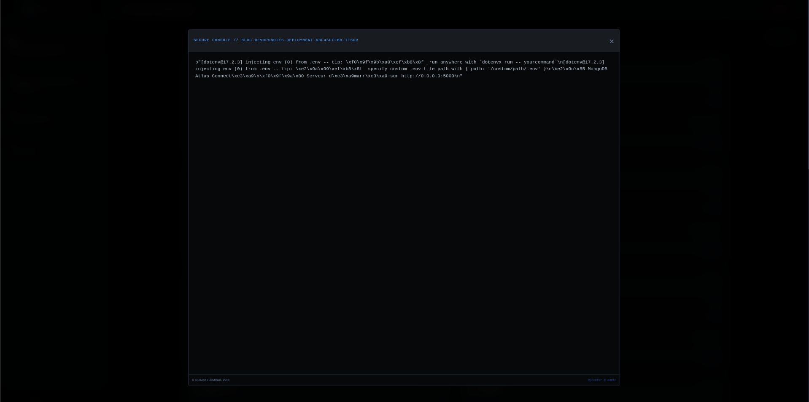
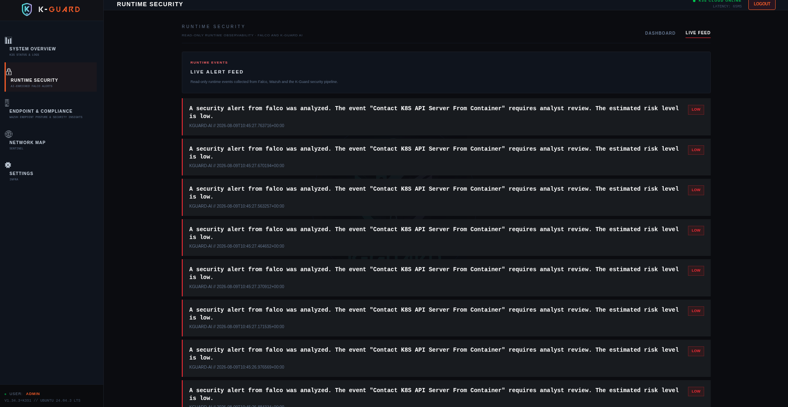
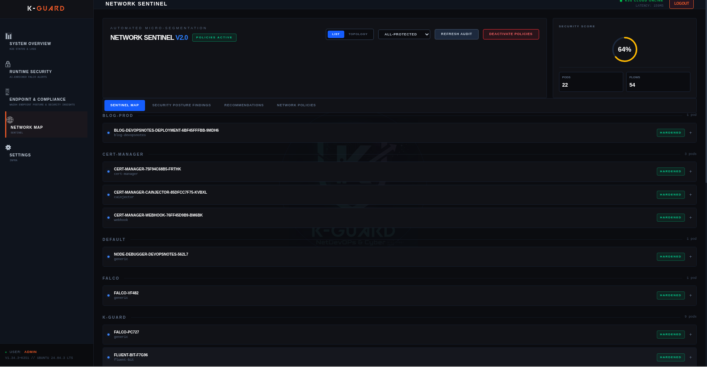
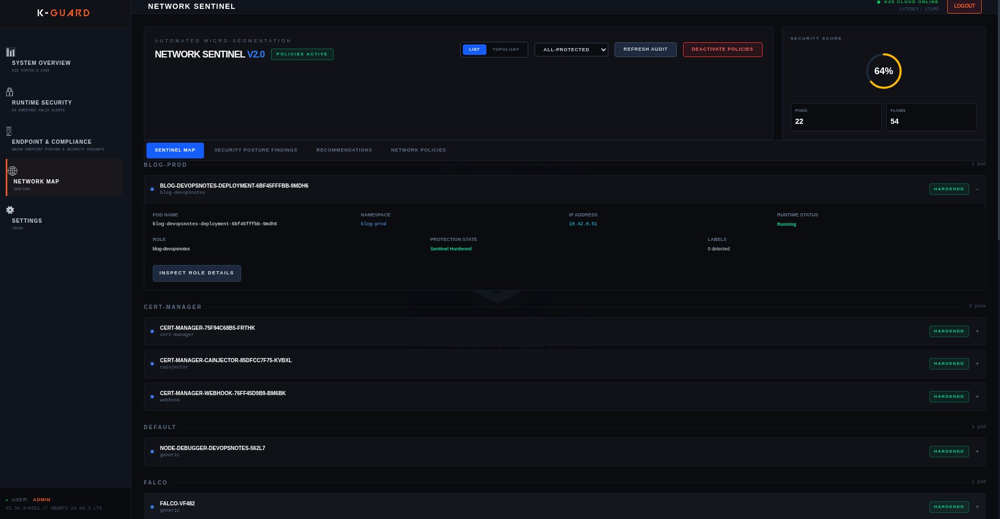
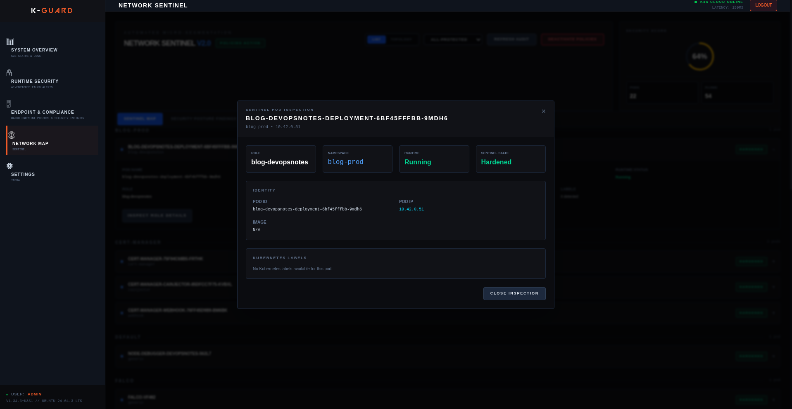
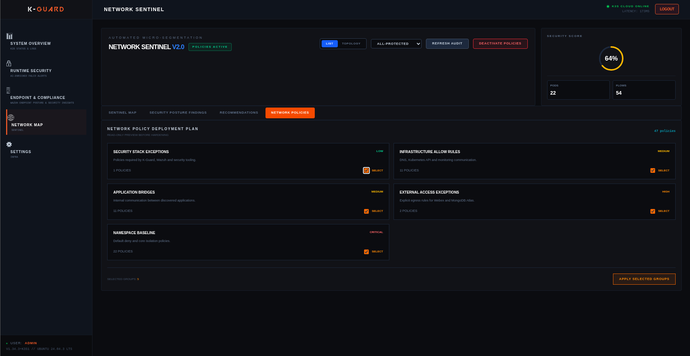
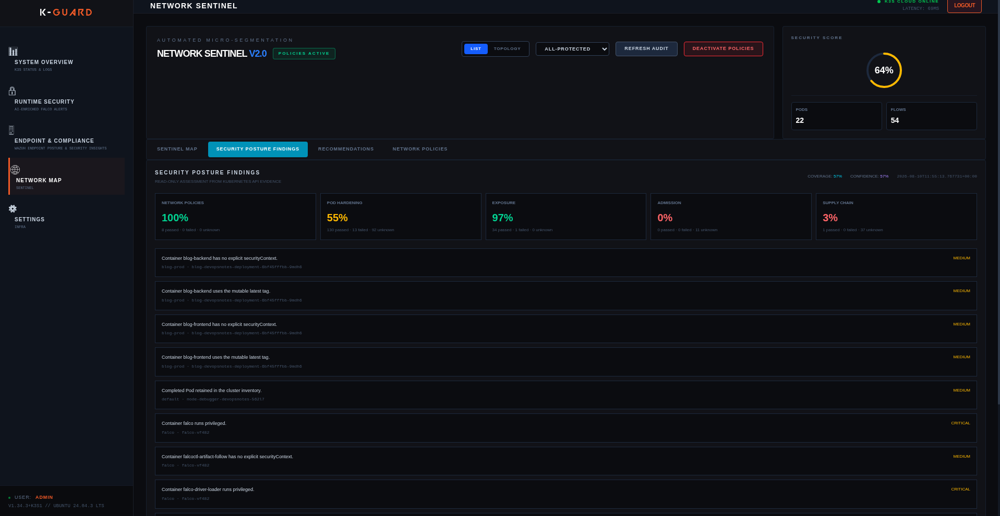
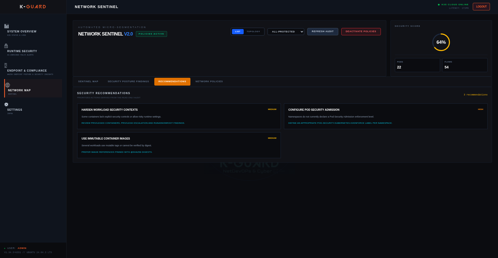
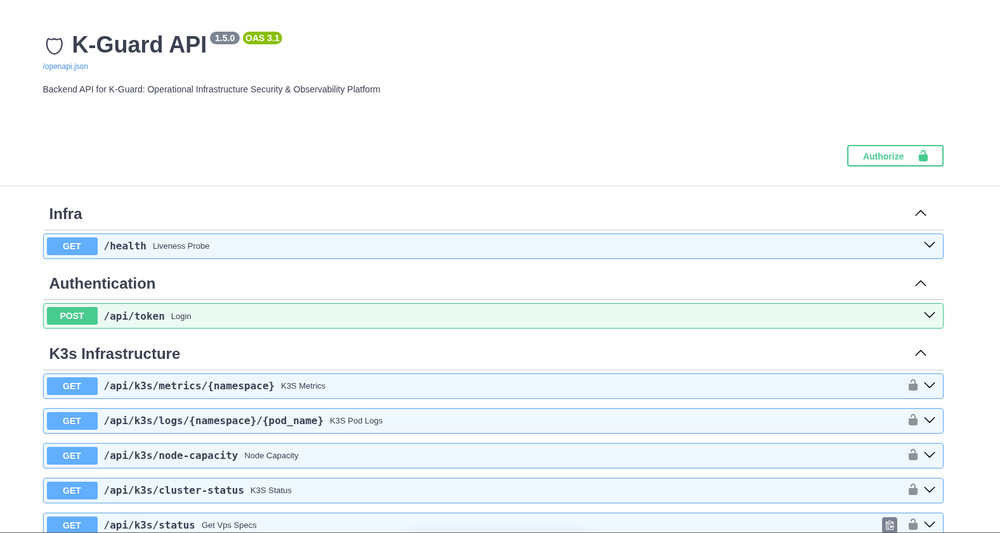

# K-Guard

**Current release:** `v1.7.0` — Native Security Monitoring & Grouped Network Policies

> A native security, observability, and network-governance platform for K3s clusters.

[](https://www.bestpractices.dev/projects/12124/baseline)

[](https://developer.cisco.com/codeexchange/github/repo/KamouloxPelvis/K-Guard)

---

## Disclaimer

**K-Guard** is engineered in alignment with modern security, DevSecOps, and infrastructure-management practices.

The project is published on the Cisco DevNet Code Exchange platform and is developed as a personal and experimental Minimum Viable Product for security governance and observability in K3s environments.

K-Guard is continuously evolving and must be reviewed, tested, and hardened before being used in a production environment.

K-Guard does not replace:

- A complete Security Operations Center process.
- A vulnerability-management program.
- An incident-response plan.
- A business-continuity strategy.
- An independent security assessment.
- Professional Kubernetes administration.
- A complete enterprise security platform.

---

## Summary

- [Overview](#overview)
- [Architecture](#architecture)
- [Key Capabilities](#key-capabilities)
- [System Overview](#system-overview)
- [Security Runtime](#security-runtime)
- [Endpoint & Compliance](#endpoint--compliance)
- [Network Sentinel](#network-sentinel)
- [Cisco Webex Notifications](#cisco-webex-notifications)
- [Security Model](#security-model)
- [Installation](#installation)
- [Dashboard Access](#dashboard-access)
- [Configuration](#configuration)
- [API Documentation](#api-documentation)
- [Troubleshooting](#troubleshooting)
- [Contact](#contact)

---

## Overview

K-Guard is a native security and observability platform designed to help protect K3s clusters from a single web dashboard.

It centralizes:

- Cluster and workload monitoring.
- Runtime-security events.
- AI-enriched security analysis.
- Wazuh endpoint visibility.
- Wazuh security posture and alerts.
- Network-policy posture.
- Network isolation controls.
- Security recommendations.
- Cisco Webex notifications.

K-Guard is designed for infrastructure, DevOps, DevSecOps, and security professionals who need a clear operational view of their Kubernetes environment without switching continuously between several external dashboards.

The main security and observability information is presented directly inside the K-Guard interface.

---

## Architecture

K-Guard follows a backend-mediated architecture.

```text
                         ┌────────────────────┐
                         │   K-Guard Web UI   │
                         │ Vue 3 / TypeScript │
                         └─────────┬──────────┘
                                   │
                                   │ HTTPS / JWT
                                   ▼
                         ┌────────────────────┐
                         │  K-Guard Backend   │
                         │ FastAPI / Python   │
                         └──────┬─────┬───────┘
                                │     │
                 ┌──────────────┘     └──────────────┐
                 ▼                                   ▼
        ┌─────────────────┐                 ┌─────────────────┐
        │ Kubernetes / K3s│                 │ Security Inputs │
        │ Workloads       │                 │ Falco / Wazuh  │
        └────────┬────────┘                 └────────┬────────┘
                 │                                   │
                 │                                   ▼
                 │                         ┌─────────────────┐
                 │                         │ K-Guard AI      │
                 │                         │ Security        │
                 │                         │ Enrichment      │
                 │                         └────────┬────────┘
                 │                                   │
                 └─────────────────┬─────────────────┘
                                   ▼
                         ┌────────────────────┐
                         │ Native K-Guard UI  │
                         │ Runtime / Wazuh /  │
                         │ Sentinel / SRE     │
                         └────────────────────┘
```

The browser communicates with the K-Guard backend through authenticated requests.

Protected infrastructure services and security credentials are not exposed directly to the browser.

K-Guard provides native dashboard pages for runtime security, endpoint visibility, security posture, alerts, and network governance.

---

## Key Capabilities

K-Guard provides a unified interface for:

- Monitoring cluster health and workload status.
- Reviewing resource usage and service availability.
- Reviewing Falco runtime-security detections.
- Enriching security events through K-Guard AI.
- Investigating runtime activity from the native Security Runtime page.
- Reviewing Wazuh endpoint inventory.
- Reviewing Wazuh security posture.
- Reviewing Wazuh alerts.
- Visualizing network relationships between workloads.
- Calculating and displaying a network-security score.
- Reviewing security recommendations.
- Selecting groups of NetworkPolicies.
- Targeting selected namespaces.
- Applying and removing Sentinel-managed policies through explicit confirmation.
- Sending operational and security notifications through Cisco Webex.
- Accessing interactive API documentation for administrators and integrators.

---

## System Overview

The **System Overview** page provides a high-level view of the monitored K3s cluster.

It helps administrators review:

- Namespace and workload visibility.
- Pod and application status.
- CPU usage.
- Memory usage.
- Pod addresses.
- Runtime status.
- Cluster latency.
- K3s information.
- Host operating-system information.
- Overall infrastructure availability.




The page is designed to provide a fast operational overview before investigating a specific security or infrastructure area.

---

## Security Runtime

The **Security Runtime** page provides native visibility into runtime-security events detected inside the K3s cluster.

The current security pipeline is:

```text
Falco
  │
  ▼
Fluent Bit
  │
  ▼
K-Guard AI
  │
  ▼
K-Guard — Security Runtime
```

Falco detects suspicious runtime activity. Fluent Bit forwards the relevant events. K-Guard AI enriches and analyzes the available security context before the information is presented in the native K-Guard dashboard.

The Security Runtime page helps administrators review:

- Suspicious container behavior.
- Kubernetes-related activity.
- Falco detections.
- AI-enriched security events.
- Event severity.
- Affected workloads and containers.
- Runtime activity trends.
- Security audit information.
- Security event distribution.
- Frequently affected containers.
- Recent security activity.

No external Kibana dashboard or ELK interface is required for normal K-Guard runtime-security usage.




The native dashboard provides the main operational views required to understand runtime activity directly inside K-Guard.

---

## Endpoint & Compliance

The **Endpoint & Compliance** page provides native Wazuh visibility directly inside K-Guard.

The current data flow is:

```text
Wazuh
  │
  ▼
K-Guard Backend
  │
  ▼
K-Guard — Endpoint & Compliance
```

K-Guard retrieves and normalizes Wazuh information through its backend, then presents the results through its own dashboard.

The Wazuh dashboard is not required for normal K-Guard usage.

Administrators can review:

- Managed endpoint inventory.
- Active agents.
- Disconnected agents.
- Never-connected agents.
- Endpoint hostname.
- Agent identifier.
- Agent version.
- IP address.
- Operating system.
- Architecture.
- Wazuh agent group.
- Last keep-alive timestamp.
- Endpoint status.
- Security posture indicators.
- Wazuh alerts.

The integration is read-only from the K-Guard interface.

K-Guard does not use the dashboard to:

- Enroll Wazuh agents.
- Restart Wazuh agents.
- Modify Wazuh rules.
- Change Wazuh policies.
- Expose Wazuh credentials.
- Expose Wazuh authentication tokens.

### Wazuh Security Posture

The Security Posture view provides a normalized security-focused overview of monitored endpoints.


### Wazuh Security Alerts

The Alerts view centralizes Wazuh alerts surfaced by the K-Guard backend.

It helps administrators:

- Review active and recent alerts.
- Identify endpoint-related security events.
- Review alert activity.
- Correlate alerts with monitored endpoints.
- Keep Wazuh credentials confined to the backend.


### Endpoint Inventory

The Endpoint & Compliance view provides a normalized inventory of monitored Wazuh agents.


---

## Network Sentinel

Network Sentinel is K-Guard's native network-security and micro-segmentation module.

It helps administrators understand and improve the network-isolation posture of their K3s cluster through a visual interface.

The module provides:

- Network topology visualization.
- Workload and namespace relationships.
- Network-security posture analysis.
- Security score.
- Security recommendations.
- Grouped NetworkPolicy management.
- Namespace targeting.
- Explicit confirmation before policy changes.
- Controlled activation of selected policy groups.
- Controlled removal of selected policy groups.
- Protection of Sentinel-managed resources.

### Network Map

The Network Map provides a visual representation of workload relationships and application communication paths.







### Policy Groups

Sentinel groups related policies into logical security domains.

Available policy groups include:

- Security exceptions.
- Infrastructure access.
- Application bridges.
- External access.
- Namespace baseline protection.

The interface exposes the number of policies associated with each group and provides a risk classification to support controlled decision-making.

Administrators can select the policy groups relevant to an operation instead of applying an unstructured list of individual policies.



### Security Posture and Score

The Sentinel security-posture view helps administrators understand the current level of network isolation.

The security score provides a concise representation of the current network-security posture and helps identify areas requiring attention.



### Security Recommendations

K-Guard can present recommendations intended to support a progressive Zero-Trust approach.

These recommendations help administrators identify potential improvements in workload isolation, policy coverage, and required traffic flows.



### Controlled Policy Operations

Network Sentinel supports controlled operations based on:

- Selected policy groups.
- Selected namespaces.
- Explicit user confirmation.
- Sentinel-managed resource protection.
- Targeted activation.
- Targeted removal.

This grouped approach helps reduce the risk of applying an unintended cluster-wide change.

Network-policy changes should always be reviewed and tested carefully because they may affect:

- DNS resolution.
- Ingress access.
- Monitoring.
- Application communication.
- Security services.
- External integrations.

Network Sentinel is designed to support progressive segmentation rather than an indiscriminate application of network restrictions.

---

## Cisco Webex Notifications

K-Guard can send operational and security notifications to a Cisco Webex room.

To configure the integration:

1. Open the **Settings** page.
2. Enable Cisco Webex notifications.
3. Enter the Bot Access Token.
4. Enter the destination Room ID.
5. Save the configuration.

The token is handled by the K-Guard backend and must not be shared publicly.


---

## Security Model

K-Guard is designed around several security principles.

### Backend-Mediated Integrations

Protected integrations are handled by the K-Guard backend.

The browser does not directly access:

- Wazuh Manager.
- Protected Kubernetes services.
- Internal security APIs.
- Credential stores.
- Security-service authentication tokens.

### Credential Protection

Sensitive credentials are handled by the backend and must never be committed to the repository or included in screenshots, issue reports, or public documentation.

This includes:

- Wazuh credentials.
- Cisco Webex tokens.
- Kubernetes credentials.
- TLS private keys.
- JWT signing keys.
- Administrator passwords.

### Read-Only Wazuh Integration

The Wazuh integration exposed through K-Guard is read-only.

K-Guard does not expose operational Wazuh administration capabilities through its dashboard.

### Explicit Sentinel Actions

Network Sentinel policy operations require explicit user confirmation.

The interface supports a review step before applying or removing selected policy groups.

Policy removal is restricted to Sentinel-managed policy resources.

### Progressive Zero-Trust

Network Sentinel is designed around progressive network segmentation.

The objective is to reduce unnecessary east-west traffic while preserving the flows required by:

- DNS.
- Kubernetes infrastructure.
- Ingress.
- Applications.
- Monitoring.
- Security services.
- Approved external integrations.

### Least Privilege

Before a production deployment, the underlying environment should be reviewed to ensure that:

- Service permissions are limited to required operations.
- Unused access rights are removed.
- Administrative accounts use strong credentials.
- Access to the dashboard is restricted.
- Persistent data is backed up.
- Security integrations are regularly reviewed.
- Network-policy changes are tested before production use.

---

## Installation

K-Guard is deployed using the installation process provided with the project.

The installer prepares the required application components and guides the administrator through the initial configuration.

### Requirements

- Debian or Ubuntu Server.
- 64-bit compatible system.
- K3s cluster.
- Administrator or sudo access.
- Internet access during installation.
- A domain name or server address for dashboard access.

### Install K-Guard

Clone the repository:

```bash
git clone https://github.com/KamouloxPelvis/k-guard.git
cd k-guard
```

Start the installer:

```bash
cd installer
chmod +x kguard-install
sudo ./kguard-install
```

Follow the installer instructions to:

- Create the initial administrator account.
- Configure the application.
- Configure optional security integrations.
- Prepare the dashboard access address.

After installation, open the dashboard using the address configured for the server.

The deployment process and internal infrastructure configuration are intentionally kept separate from normal dashboard usage.

---

## Dashboard Access

Open K-Guard using the address configured during installation:

```text
https://<your-domain>
```

or:

```text
http://<your-server-address>
```

After signing in, the dashboard provides access to:

- System Overview.
- Security Runtime.
- Endpoint & Compliance.
- Network Sentinel.
- Settings.

The dashboard is designed to centralize the main security and monitoring information in one place.

---

## Configuration

Most K-Guard configuration is performed through the web interface.

From the **Settings** page, administrators can configure available integrations such as Cisco Webex and review the connection status of supported security services.

Network Sentinel operations are configured directly from the Sentinel interface through:

- Policy-group selection.
- Namespace selection.
- Security-posture review.
- Explicit confirmation.

Sensitive credentials are handled by the backend and should never be added to:

- The Git repository.
- Screenshots.
- Issue reports.
- Chat messages.
- Public documentation.
- Frontend source code.

---

## API Documentation

K-Guard provides interactive API documentation through Swagger UI for administrators and integrators.

The documentation is available through:

```text
http://<your-domain-or-ip>/docs
```

The API documentation provides an overview of authenticated services and integration endpoints.



API access is protected by K-Guard authentication and is intended for administrative and integration purposes.

---

## Troubleshooting

### The dashboard cannot be reached

Check that:

- The server is online.
- The configured domain points to the correct server.
- The HTTPS certificate is valid.
- The installation completed successfully.
- The browser is using the correct dashboard address.

### Security Runtime information is unavailable

Check that:

- The runtime-security integration is configured.
- Falco is operating correctly.
- The event-forwarding pipeline is available.
- K-Guard AI is reachable by the backend.
- The K-Guard backend is operational.

If the problem persists, contact the person responsible for the K-Guard installation.

### Wazuh information is unavailable

Check that:

- The Wazuh integration is configured.
- The Wazuh services are running.
- The credentials provided during installation are still valid.
- The K-Guard backend can reach the Wazuh service.

### Webex notifications are not received

Check that:

- Cisco Webex is enabled in **Settings**.
- The Bot Access Token is valid.
- The Room ID is correct.
- The Webex room accepts messages from the configured bot.

### Network Sentinel data is unavailable

Check that:

- The cluster is reachable.
- The required security services are operational.
- The network-security integration is correctly configured.
- The requested operation was confirmed in the interface.

### A new feature is not visible

Try the following:

1. Refresh the page.
2. Clear the browser cache.
3. Sign out and sign in again.
4. Contact the person responsible for the K-Guard installation if the issue remains.

---

## Contact

© 2026 **Kamal Guidadou** — SysAdmin & DevSecOps

- Portfolio: <https://portfolio.devopsnotes.org>
- Technical blog: <https://blog.devopsnotes.org>
- Cisco DevNet Code Exchange: <https://developer.cisco.com/codeexchange/github/repo/KamouloxPelvis/K-Guard>
- GitHub: <https://github.com/KamouloxPelvis/k-guard>