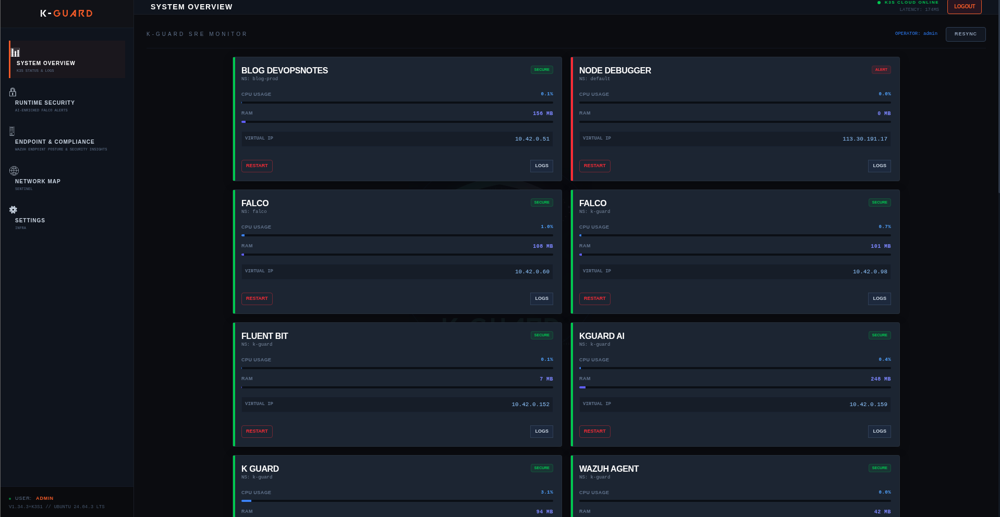
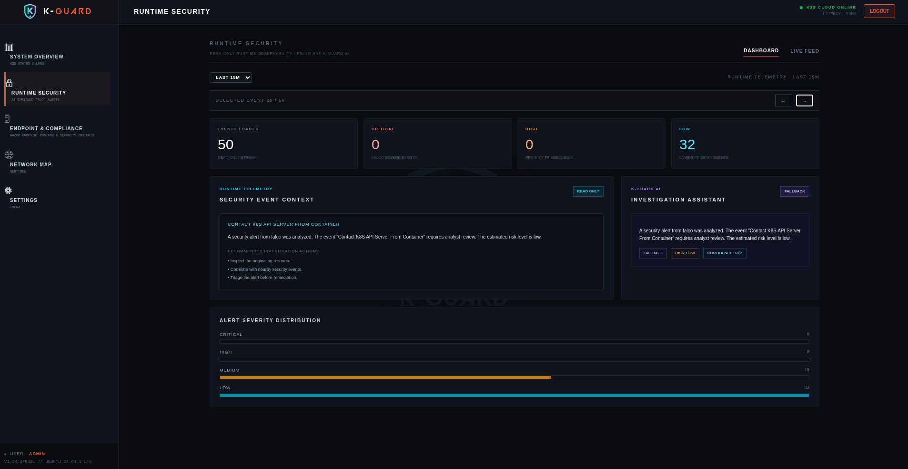
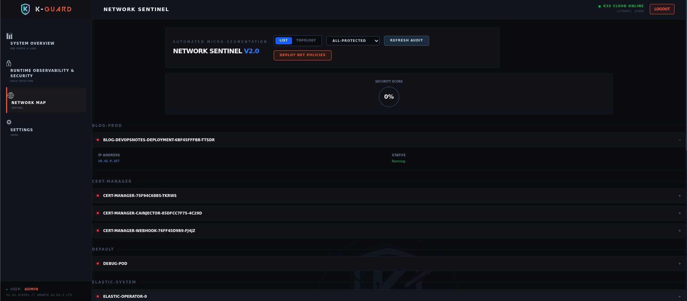
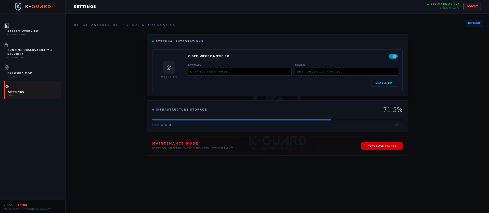
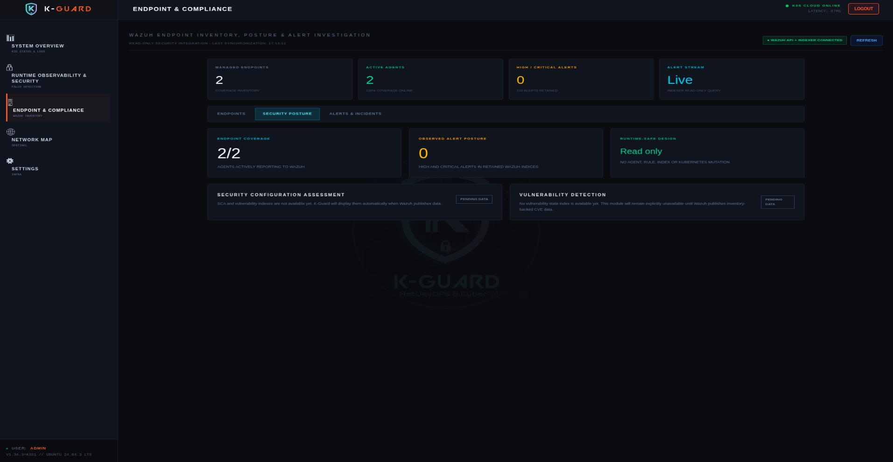
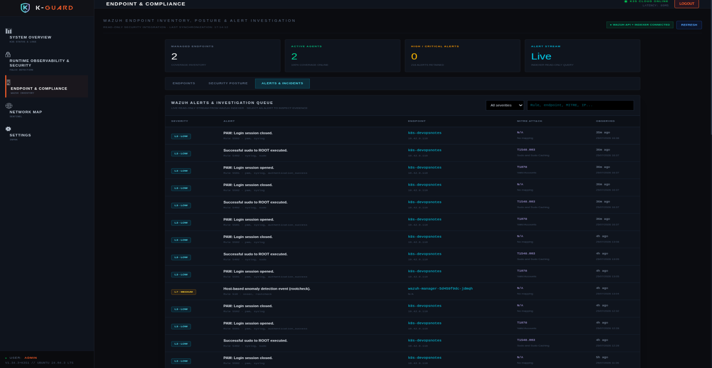
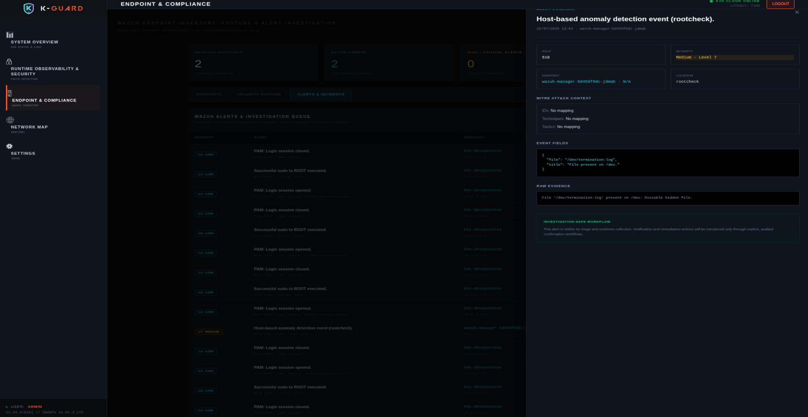
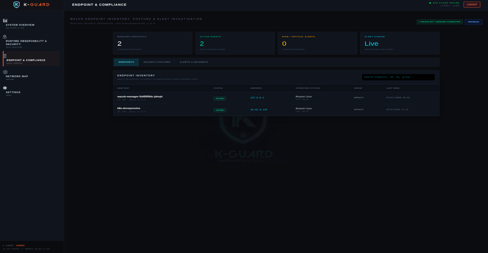
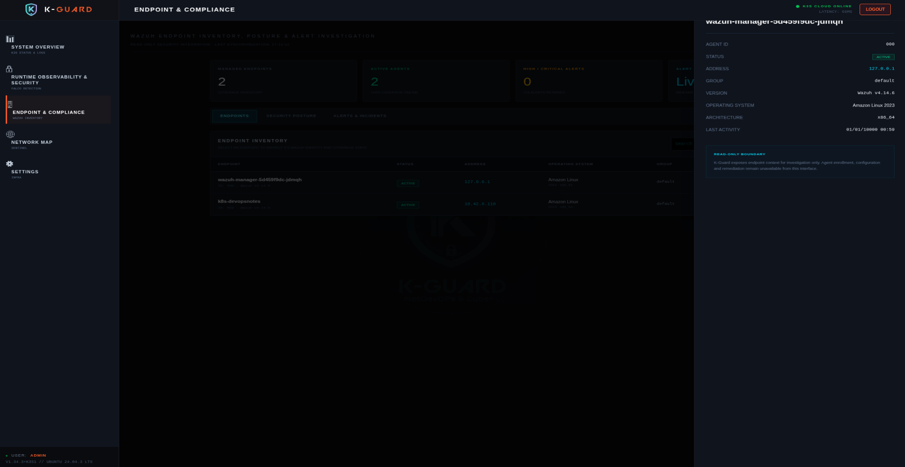
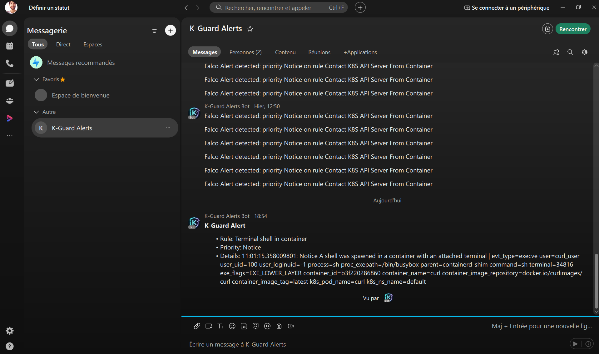

# K-Guard

**Current release:** `v1.6.0` — Wazuh Security Posture & Alerts

> Security governance and observability platform for K3s clusters.

[](https://www.bestpractices.dev/projects/12124)
[](https://developer.cisco.com/codeexchange/github/repo/KamouloxPelvis/K-Guard)

## ⚠️ Disclaimer

**K-Guard** is engineered in alignment with industry security standards and is published on the Cisco DevNet Code Exchange platform.

However, this software is a personal and experimental Minimum Viable Product (MVP), designed as a research and learning platform for DevSecOps security architectures. It is continuously evolving and must be reviewed, tested, and hardened before being used in a production environment.

K-Guard does not replace a complete SOC process, vulnerability-management program, incident-response plan, or independent security assessment.

---

## 📍 Summary

- [Overview](#overview)
- [Architecture](#architecture)
- [Tech Stack](#tech-stack)
- [Key Features](#key-features)
- [Wazuh Endpoint & Compliance](#wazuh-endpoint--compliance)
- [Wazuh Security Posture & Alerts](#wazuh-security-posture--alerts)
- [Wazuh Credentials](#wazuh-credentials)
- [Runtime Security](#runtime-security)
- [Network Sentinel](#network-sentinel)
- [Cisco Webex Integration](#cisco-webex-integration)
- [API Documentation](#api-documentation)
- [Installation](#installation)
- [Dashboard Access](#dashboard-access)
- [Security Notes](#security-notes)
- [Troubleshooting](#troubleshooting)
- [Contact](#contact)

---

## Overview

K-Guard is a security governance and observability platform for K3s clusters.

It centralizes infrastructure health, Kubernetes workload visibility, runtime threat detection, endpoint inventory, security integrations, and selected network-security controls in a single operational dashboard.

K-Guard currently integrates:

- **K3s / Kubernetes** for cluster, workload, pod, and infrastructure monitoring
- **Falco** for runtime detection
- **Fluent Bit** for log forwarding
- **Elasticsearch and Kibana** for log storage, search, and SOC visualization
- **Wazuh** for endpoint inventory and compliance-oriented visibility
- **Cisco Webex** for ChatOps alerting
- **Ansible and Kubernetes NetworkPolicies** for Network Sentinel experimentation

---

## Architecture

```text
                         ┌────────────────────┐
                         │   K-Guard UI       │
                         │ Vue 3 / Tailwind   │
                         └─────────┬──────────┘
                                   │
                                   │ HTTPS / JWT
                                   ▼
                         ┌────────────────────┐
                         │  K-Guard Backend   │
                         │ FastAPI / Python   │
                         └─────────┬──────────┘
                                   │
          ┌────────────────────────┼────────────────────────┐
          │                        │                        │
          ▼                        ▼                        ▼
┌─────────────────┐     ┌─────────────────┐     ┌─────────────────┐
│ Kubernetes API  │     │ Wazuh Manager   │     │ Elasticsearch   │
│ K3s workloads   │     │ HTTPS API       │     │ Runtime events  │
└─────────────────┘     │ Port 55000      │     └─────────────────┘
                        └─────────────────┘
                                   │
                                   ▼
                         ┌────────────────────┐
                         │ Wazuh Dashboard    │
                         │ Endpoint Security  │
                         └────────────────────┘
```

The browser never communicates directly with the Wazuh Manager API. K-Guard retrieves Wazuh information from its backend, which keeps Wazuh credentials and Wazuh JWT tokens inside the Kubernetes workload.

---

## Tech Stack

### Backend

- Python 3.11+
- FastAPI
- Uvicorn
- HTTPX
- Kubernetes Python client
- SQLite
- JWT authentication
- Bcrypt password hashing

### Frontend

- Vue.js 3
- Vue Router
- TypeScript
- Tailwind CSS
- Native Fetch API

### Security and Observability

- K3s / Kubernetes
- Falco
- Fluent Bit
- Elasticsearch
- Kibana
- Wazuh
- Cisco Webex
- Ansible Core
- Kubernetes NetworkPolicies

### Deployment

- Docker
- GitHub Actions
- GitHub Container Registry
- Kubernetes manifests
- Go-based installer

---

## Key Features

### System Overview

The **System Overview** page provides operational visibility into the monitored Kubernetes cluster.

It displays workload information such as:

- Namespace
- Pod or workload name
- CPU usage
- Memory usage
- Pod IP address
- Runtime status
- Cluster latency
- K3s and host information



### Runtime Observability & Security

The **Runtime Observability & Security** module integrates Falco runtime alerts with Elasticsearch and Kibana.

It provides:

- Runtime detection visibility
- Falco alert ingestion
- Container and Kubernetes behavioral monitoring
- Elasticsearch-backed event storage
- Kibana dashboards for investigation and visualization



### Endpoint & Compliance

The **Endpoint & Compliance** page integrates K-Guard with the Wazuh Manager API.

The first version is intentionally read-only and provides a normalized inventory of monitored Wazuh agents.

It displays:

- Total managed endpoints
- Active agents
- Disconnected agents
- Never-connected agents
- Endpoint hostname
- Agent identifier
- Agent version
- IP address
- Operating system
- Architecture
- Wazuh agent group
- Last keep-alive timestamp

The integration is designed so that Wazuh API credentials and short-lived Wazuh JWT tokens remain inside the K-Guard backend pod.

### Network Sentinel

The **Network Sentinel** module is intended to support Zero-Trust network segmentation through Kubernetes `NetworkPolicy` resources and Ansible automation.

Its long-term purpose is to help an administrator:

- Review network-isolation posture
- Apply controlled baseline policies
- Restrict unnecessary east-west traffic
- Preserve required DNS, Kubernetes API, monitoring, ingress, and application flows
- Audit policy deployment actions

> Network Sentinel should be used carefully. A default-deny policy can disrupt workloads when required traffic is not explicitly allowed.



### Cisco Webex ChatOps

K-Guard can send security notifications through Cisco Webex.

The integration is configured in the **Settings** page and stores its settings in the local K-Guard SQLite database.



---

## Wazuh Endpoint & Compliance

### Purpose

K-Guard uses the Wazuh Manager API to retrieve endpoint inventory information and expose it in the **Endpoint & Compliance** dashboard page.

The current integration is read-only. It does not enroll agents, restart agents, modify Wazuh rules, change policies, or expose Wazuh credentials to the browser.

### Network Flow

```text
Browser
  │
  │ JWT-authenticated request
  ▼
K-Guard API
  │
  │ HTTPS + Wazuh API credentials
  ▼
Wazuh Manager Service
  │
  │ GET /agents
  ▼
Normalized endpoint inventory
```

### Required Kubernetes Resources

The K-Guard deployment requires:

- A Wazuh Manager Service exposing port `55000`
- The `wazuh-manager-credentials` Secret
- The `wazuh-api-ca` Secret
- A valid TLS certificate on the Wazuh Manager API
- DNS SAN entries matching the Kubernetes Service name

The expected Wazuh Manager API URL is:

```text
https://wazuh-manager-service.k-guard.svc.cluster.local:55000
```

### Required TLS SAN Entries

The Wazuh Manager API certificate should include at least:

```text
DNS:wazuh-manager-service
DNS:wazuh-manager-service.k-guard
DNS:wazuh-manager-service.k-guard.svc
DNS:wazuh-manager-service.k-guard.svc.cluster.local
```

K-Guard performs strict TLS certificate validation. Do not configure the integration with `verify=False` or disable hostname validation.

### Wazuh API CA Secret

K-Guard mounts the Wazuh API certificate authority as a read-only Kubernetes Secret.

Expected Secret structure:

```text
Secret name: wazuh-api-ca
Key: ca.pem
Mount path: /etc/kguard/wazuh-api-ca/ca.pem
```

Verify that the Secret exists:

```bash
kubectl get secret wazuh-api-ca \
  -n k-guard \
  -o jsonpath='{.data}' | jq 'keys'
```

Expected result:

```text
[
  "ca.pem"
]
```

### Validate Wazuh API Connectivity

Run this command from the K-Guard pod to validate strict TLS connectivity:

```bash
POD=$(kubectl get pod -n k-guard \
  -l app=k-guard \
  -o jsonpath='{.items.metadata.name}')

kubectl exec -n k-guard "$POD" -- sh -c \
'python - <<'"'"'PY'"'"'
import os
import socket
import ssl

host = "wazuh-manager-service.k-guard.svc.cluster.local"

context = ssl.create_default_context(
    cafile=os.environ["WAZUH_API_CA_FILE"]
)

with socket.create_connection((host, 55000), timeout=5) as raw:
    with context.wrap_socket(raw, server_hostname=host) as tls:
        certificate = tls.getpeercert()
        print("TLS: OK")
        print("Subject:", certificate.get("subject"))
        print("Issuer:", certificate.get("issuer"))
        print("SAN:", certificate.get("subjectAltName"))
PY'
```

A successful result should include:

```text
TLS: OK
```

### Validate Agent Inventory

The following test authenticates to the Wazuh API and retrieves the number of agents without printing the password or JWT token:

```bash
POD=$(kubectl get pod -n k-guard \
  -l app=k-guard \
  -o jsonpath='{.items.metadata.name}')

kubectl exec -n k-guard "$POD" -- sh -c \
'python - <<'"'"'PY'"'"'
import json
import os
import ssl
import urllib.request
from base64 import b64encode

base_url = os.environ["WAZUH_API_URL"]
ca_file = os.environ["WAZUH_API_CA_FILE"]
username = os.environ["WAZUH_API_USERNAME"]
password = os.environ["WAZUH_API_PASSWORD"]

context = ssl.create_default_context(cafile=ca_file)
basic = b64encode(f"{username}:{password}".encode()).decode()

auth_request = urllib.request.Request(
    f"{base_url}/security/user/authenticate?raw=true",
    headers={"Authorization": f"Basic {basic}"},
    method="GET",
)

with urllib.request.urlopen(auth_request, context=context, timeout=10) as response:
    token = response.read().decode().strip()
    print("AUTH:", response.status)

agents_request = urllib.request.Request(
    f"{base_url}/agents?limit=1",
    headers={"Authorization": f"Bearer {token}"},
    method="GET",
)

with urllib.request.urlopen(agents_request, context=context, timeout=10) as response:
    payload = json.loads(response.read().decode())
    total = payload.get("data", {}).get("total_affected_items", 0)
    print("AGENTS:", response.status)
    print("TOTAL:", total)
PY'
```

Expected output:

```text
AUTH: 200
AGENTS: 200
TOTAL: <number_of_agents>
```

---

## Wazuh Security Posture & Alerts

### Purpose

K-Guard uses the Wazuh Manager API to retrieve endpoint inventory, security posture indicators, and alert data, then exposes them in the dashboard.

The current integration is read-only. It does not enroll agents, restart agents, modify Wazuh rules, change policies, or expose Wazuh credentials to the browser.

### Security Posture

The Security Posture view provides a normalized security-focused overview of monitored endpoints.

It highlights:

- Endpoint posture and compliance signals.
- Managed agent inventory.
- State of monitored assets.
- Read-only security visibility for operational review.



### Alerts

The Alerts view centralizes Wazuh alerts surfaced by the backend.

It is designed to help an operator:

- Review active and recent alerts.
- Investigate endpoint-related security events.
- Correlate alert volume with endpoint posture.
- Keep Wazuh credentials confined to the backend.





### Endpoint Inventory

The Endpoint & Compliance page provides a normalized inventory of monitored Wazuh agents.

It displays:

- Total managed endpoints.
- Active agents.
- Disconnected agents.
- Never-connected agents.
- Endpoint hostname.
- Agent identifier.
- Agent version.
- IP address.
- Operating system.
- Architecture.
- Wazuh agent group.
- Last keep-alive timestamp.





---

## Wazuh Credentials

### Important Distinction

K-Guard uses two different authentication layers:

| Authentication layer | Purpose | Used by |
|---|---|---|
| K-Guard JWT | Secures the K-Guard dashboard and `/api/*` routes | K-Guard users |
| Wazuh API credentials | Authenticates K-Guard backend to the Wazuh Manager API | K-Guard backend only |
| Wazuh Dashboard credentials | Logs into the Wazuh Dashboard web interface | Wazuh administrators |

Do not use the K-Guard administrator password as a Wazuh password unless this is an explicit and documented local decision.

### Create Wazuh API Credentials

The K-Guard backend expects the following Kubernetes Secret:

```text
Secret name: wazuh-manager-credentials
Required keys:
- api-username
- api-password
- indexer-username
- indexer-password
```

For a new deployment, define strong credentials before applying the Wazuh Manager manifest:

```bash
export WAZUH_API_USERNAME="kguard-api"
export WAZUH_API_PASSWORD="CHANGE_THIS_TO_A_STRONG_PASSWORD"
export WAZUH_INDEXER_USERNAME="admin"
export WAZUH_INDEXER_PASSWORD="CHANGE_THIS_TO_YOUR_INDEXER_PASSWORD"
```

Create or update the Secret:

```bash
kubectl create secret generic wazuh-manager-credentials \
  -n k-guard \
  --from-literal=api-username="$WAZUH_API_USERNAME" \
  --from-literal=api-password="$WAZUH_API_PASSWORD" \
  --from-literal=indexer-username="$WAZUH_INDEXER_USERNAME" \
  --from-literal=indexer-password="$WAZUH_INDEXER_PASSWORD" \
  --dry-run=client -o yaml | kubectl apply -f -
```

Unset sensitive shell variables after use:

```bash
unset WAZUH_API_USERNAME
unset WAZUH_API_PASSWORD
unset WAZUH_INDEXER_USERNAME
unset WAZUH_INDEXER_PASSWORD
```

> Do not commit passwords, certificate private keys, decoded Secrets, `.env` files, or generated kubeconfig files to Git.

### Inspect Available Secret Keys

Before retrieving an existing credential, inspect only the Secret keys:

```bash
kubectl get secret wazuh-manager-credentials \
  -n k-guard \
  -o jsonpath='{.data}' | jq 'keys'
```

For the Wazuh Dashboard Secret:

```bash
kubectl get secret wazuh-dashboard-credentials \
  -n k-guard \
  -o jsonpath='{.data}' | jq 'keys'
```

For the Wazuh Indexer administrator password Secret:

```bash
kubectl get secret wazuh-indexer-admin-password \
  -n k-guard \
  -o jsonpath='{.data}' | jq 'keys'
```

### Retrieve Existing Wazuh API Credentials

Retrieve the API username:

```bash
kubectl get secret wazuh-manager-credentials \
  -n k-guard \
  -o jsonpath='{.data.api-username}' | base64 --decode

echo
```

Retrieve the API password:

```bash
kubectl get secret wazuh-manager-credentials \
  -n k-guard \
  -o jsonpath='{.data.api-password}' | base64 --decode

echo
```

Do not paste the output into tickets, chat tools, Git commits, screenshots, shell history, or public documentation.

### Retrieve Wazuh Dashboard Credentials

The exact key names may vary depending on the deployment manifest. First inspect the keys:

```bash
kubectl get secret wazuh-dashboard-credentials \
  -n k-guard \
  -o jsonpath='{.data}' | jq 'keys'
```

If the Secret uses `username` and `password` keys, retrieve them as follows:

```bash
kubectl get secret wazuh-dashboard-credentials \
  -n k-guard \
  -o jsonpath='{.data.username}' | base64 --decode

echo
```

```bash
kubectl get secret wazuh-dashboard-credentials \
  -n k-guard \
  -o jsonpath='{.data.password}' | base64 --decode

echo
```

If the deployment uses a dedicated administrator password Secret with a `password` key:

```bash
kubectl get secret wazuh-indexer-admin-password \
  -n k-guard \
  -o jsonpath='{.data.password}' | base64 --decode

echo
```

### Change Wazuh Passwords

Use the Wazuh Dashboard user-administration interface or the official Wazuh password-management process to rotate credentials.

When rotating the Wazuh API password used by K-Guard:

1. Update the Wazuh API user password.
2. Update the `wazuh-manager-credentials` Secret.
3. Restart the K-Guard deployment.
4. Validate `/api/wazuh/agents`.
5. Confirm the Endpoint & Compliance page reconnects successfully.

Restart K-Guard after changing the Secret:

```bash
kubectl rollout restart deployment/kguard-deployment -n k-guard

kubectl rollout status deployment/kguard-deployment \
  -n k-guard \
  --timeout=180s
```

---

## Runtime Security

### Falco, Fluent Bit, Elasticsearch, and Kibana

K-Guard integrates a runtime-security pipeline based on Falco, Fluent Bit, Elasticsearch, and Kibana.

```text
Falco runtime event
      │
      ▼
Fluent Bit collection and forwarding
      │
      ▼
Elasticsearch indexing
      │
      ▼
Kibana investigation and visualization
```

The Runtime Observability & Security page is intended to provide operational visibility into runtime activity and stored security events.


### Access Elasticsearch Credentials

Retrieve the Elasticsearch `elastic` user password:

```bash
kubectl get secret elasticsearch-es-elastic-user \
  -n k-guard \
  -o go-template='{{.data.elastic | base64decode}}'

echo
```

Store the password securely and do not commit it to Git.

---

## Network Sentinel

### Purpose

Network Sentinel is the K-Guard network-security module.

It is intended to apply and manage Kubernetes NetworkPolicies through Ansible automation, supporting a Zero-Trust approach to east-west traffic.

### NetworkPolicy Requirement

Kubernetes NetworkPolicies only have an effect when the cluster uses a CNI that enforces them.

Recommended CNIs include:

- Calico
- Cilium
- Kube-router
- Other NetworkPolicy-capable CNIs

The default Flannel CNI can keep cluster workloads functional while not enforcing NetworkPolicy resources.

### Sentinel Policy Components

The infrastructure templates include policies for:

- Default-deny isolation
- DNS resolution
- Kubernetes API access
- Monitoring access
- Ingress-controller to application traffic
- Approved external egress
- Security-stack exceptions
- Wazuh and Falco-related connectivity where required

### Operational Warning

Applying default-deny network policies without validating required workload flows can interrupt:

- DNS resolution
- Ingress traffic
- Prometheus scraping
- Grafana access
- Kubernetes API access
- Wazuh communication
- Elasticsearch or Kibana connectivity
- External API integrations such as Cisco Webex

Network Sentinel should therefore be activated only after:

1. Reviewing namespaces and workloads.
2. Identifying required ports and service dependencies.
3. Testing in a non-production environment.
4. Confirming that the CNI enforces NetworkPolicies.
5. Preparing a rollback procedure.

---

## Cisco Webex Integration

K-Guard supports Cisco Webex notifications for security and operational alerts.

### Configure Webex

1. Open the **Settings** page.
2. Enable the Cisco Webex notifier.
3. Enter the Bot Access Token.
4. Enter the destination Room ID.
5. Save the integration.

The Webex token is sent to the K-Guard backend and must never be committed to source control.



---

## API Documentation

K-Guard exposes interactive OpenAPI documentation through Swagger UI.

```text
http://<your-domain-or-ip>/docs
```

The API documentation includes:

- Authentication and JWT token management
- K3s infrastructure endpoints
- Health checks
- Runtime-security endpoints
- Wazuh endpoint inventory
- Integration-management endpoints

### Wazuh API Endpoint

K-Guard exposes a protected endpoint for the Wazuh endpoint inventory:

```text
GET /api/wazuh/agents
```

The request requires a valid K-Guard JWT:

```text
Authorization: Bearer <kguard-jwt-token>
```

The endpoint does not expose:

- Wazuh API credentials
- Wazuh JWT tokens
- Wazuh certificate private keys
- Kubernetes Secret values

---

## Installation

### Prerequisites

- Debian or Ubuntu Server
- Root or sudo access
- x86_64-compatible host
- K3s cluster
- Docker or container runtime required by the deployment process
- Git
- Python 3 and Pip
- Kubernetes CLI (`kubectl`)
- Internet access to retrieve container images

### Install K3s

```bash
curl -sfL https://get.k3s.io | sh -
```

### Install Docker

```bash
sudo apt update
sudo apt install -y docker.io
```

### Clone the Repository

```bash
git clone https://github.com/KamouloxPelvis/k-guard.git

cd k-guard
```

### Go Installer

The repository includes a Go-based installer intended to:

- Check required dependencies
- Validate Docker socket availability
- Generate or synchronize selected secrets
- Hash local K-Guard credentials with bcrypt
- Deploy core Kubernetes resources

Run the installer from the relevant installer directory:

```bash
cd installer

chmod +x kguard-install

sudo ./kguard-install
```

> Review the installer source and Kubernetes manifests before running them in an environment containing sensitive workloads.

### Deploy Wazuh Components

Wazuh manifests are located in:

```text
k8s/wazuh/
```

Review the manifests, Secrets, storage classes, services, and namespaces before deployment.

Typical deployment flow:

```bash
cd k8s/wazuh

kubectl apply -f .
```

Check component status:

```bash
kubectl get pods -n k-guard
```

Expected components include:

```text
wazuh-manager
wazuh-indexer
wazuh-dashboard
wazuh-agent
kguard-deployment
falco
fluent-bit
elasticsearch
kibana
```

---

## Dashboard Access

### K-Guard

Access the K-Guard dashboard through the configured Ingress, node IP, or domain:

```text
http://<VPS_IP>
```

or:

```text
https://<your-domain>
```

### Wazuh Dashboard

The Wazuh Dashboard is exposed through its configured Service or Ingress.

For a NodePort deployment:

```text
http://<your-ip>:5601
```

Use the Wazuh Dashboard credentials configured in Kubernetes Secrets.

### Endpoint & Compliance

After logging into K-Guard:

1. Open **Endpoint & Compliance** from the sidebar.
2. Confirm the status displays `Wazuh API Connected`.
3. Review agent counts.
4. Search endpoints by hostname, address, group, operating system, or status.
5. Use **Refresh** to force a new inventory request.

---

## CI/CD and Image Tags

K-Guard is built and deployed through GitHub Actions.

Each deployment publishes two container-image tags:

```text
ghcr.io/kamouloxpelvis/kguard-app:latest
ghcr.io/kamouloxpelvis/kguard-app:<git-sha>
```

Kubernetes deployments should use the immutable Git SHA image tag:

```text
ghcr.io/kamouloxpelvis/kguard-app:<git-sha>
```

The `latest` tag is useful for manual testing, but it should not be the primary production deployment reference because it is mutable.

Verify the image currently used by K-Guard:

```bash
kubectl get deployment kguard-deployment \
  -n k-guard \
  -o jsonpath='{.spec.template.spec.containers.image}{"\n"}'
```

Verify the image digest running in the pod:

```bash
kubectl get pod -n k-guard -l app=k-guard \
  -o jsonpath='{range .items[*]}{.metadata.name}{"\n"}{.status.containerStatuses.imageID}{"\n"}{end}'
```

---

## Security Notes

### Secrets

Kubernetes Secrets may contain:

- K-Guard JWT signing keys
- Administrator hashes
- Elasticsearch credentials
- Wazuh API credentials
- Wazuh Dashboard credentials
- Webex tokens
- TLS certificates
- TLS private keys

Never commit:

```text
.env
*.pem
*.key
kubeconfig.yaml
decoded Secret values
password files
JWT tokens
Webex tokens
```

### Wazuh TLS

K-Guard validates the Wazuh Manager certificate using a mounted CA file.

Do not weaken the integration by:

```python
verify=False
```

Do not disable hostname verification.

### Least Privilege

The current MVP may require Kubernetes permissions for observability and operational controls.

Before a production deployment:

- Review ServiceAccount permissions.
- Review Roles and ClusterRoles.
- Remove unused permissions.
- Remove unused Linux capabilities.
- Review hostPath mounts.
- Review Docker socket access.
- Restrict access to the Kubernetes API.
- Apply namespace-level network isolation.
- Rotate default credentials.
- Enable backups for persistent volumes and application data.

---

## Troubleshooting

### Endpoint & Compliance Is Unavailable

Check K-Guard logs:

```bash
kubectl logs -n k-guard -l app=k-guard --tail=200
```

Check the Wazuh Manager:

```bash
kubectl get pods -n k-guard -l app=wazuh-manager
```

Check the Wazuh Manager Service:

```bash
kubectl get svc wazuh-manager-service -n k-guard
```

Check the Wazuh CA Secret:

```bash
kubectl get secret wazuh-api-ca -n k-guard
```

Check the Wazuh credentials Secret:

```bash
kubectl get secret wazuh-manager-credentials -n k-guard
```

### New Frontend Features Do Not Appear

Confirm the Deployment image:

```bash
kubectl get deployment kguard-deployment \
  -n k-guard \
  -o jsonpath='{.spec.template.spec.containers.image}{"\n"}'
```

Inspect whether the deployed frontend bundle contains the expected feature text:

```bash
POD=$(kubectl get pod -n k-guard \
  -l app=k-guard \
  -o jsonpath='{.items.metadata.name}')

kubectl exec -n k-guard "$POD" -- sh -c \
'grep -Ril "Endpoint & Compliance\|Wazuh Inventory" /app/static 2>/dev/null | head'
```

If no result is returned:

- Confirm the feature files are committed.
- Confirm GitHub Actions built the correct commit.
- Confirm the Deployment uses the SHA generated by that workflow run.
- Confirm the Docker build context includes `frontend/`.
- Confirm the frontend build completes successfully.

### Check Current Pods

```bash
kubectl get pods -n k-guard
```

### Check K-Guard Rollout

```bash
kubectl rollout status deployment/kguard-deployment \
  -n k-guard \
  --timeout=180s
```

### Restart K-Guard

```bash
kubectl rollout restart deployment/kguard-deployment -n k-guard

kubectl rollout status deployment/kguard-deployment \
  -n k-guard \
  --timeout=180s
```

---

## Contact

© 2026 **Kamal Guidadou** — SysAdmin & DevSecOps

- Portfolio: <https://portfolio.devopsnotes.org>
- Technical blog: <https://blog.devopsnotes.org>
- Cisco DevNet Code Exchange: <https://developer.cisco.com/codeexchange/github/repo/KamouloxPelvis/K-Guard>
- GitHub: <https://github.com/KamouloxPelvis/k-guard>